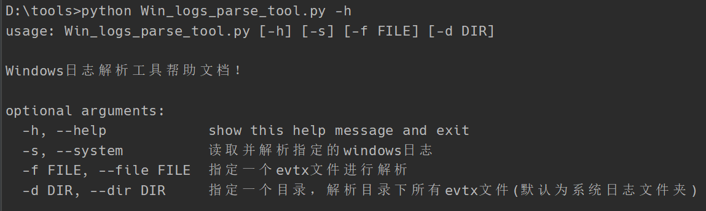
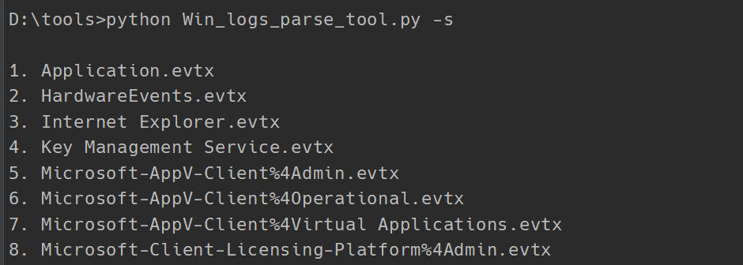
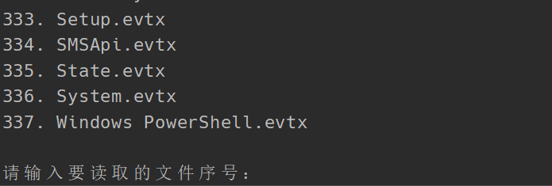
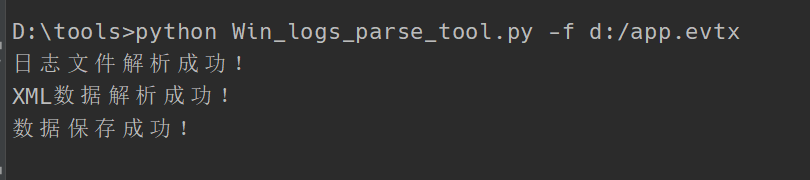
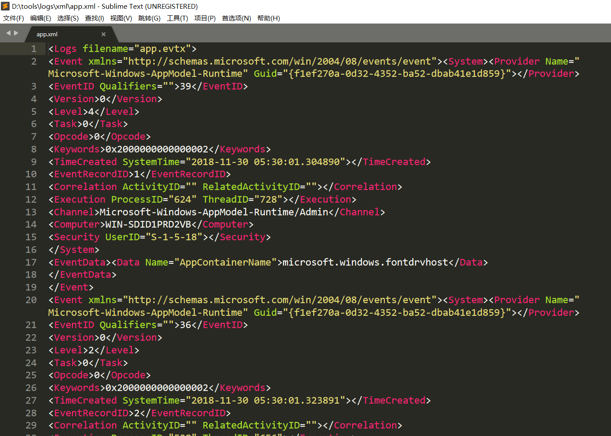
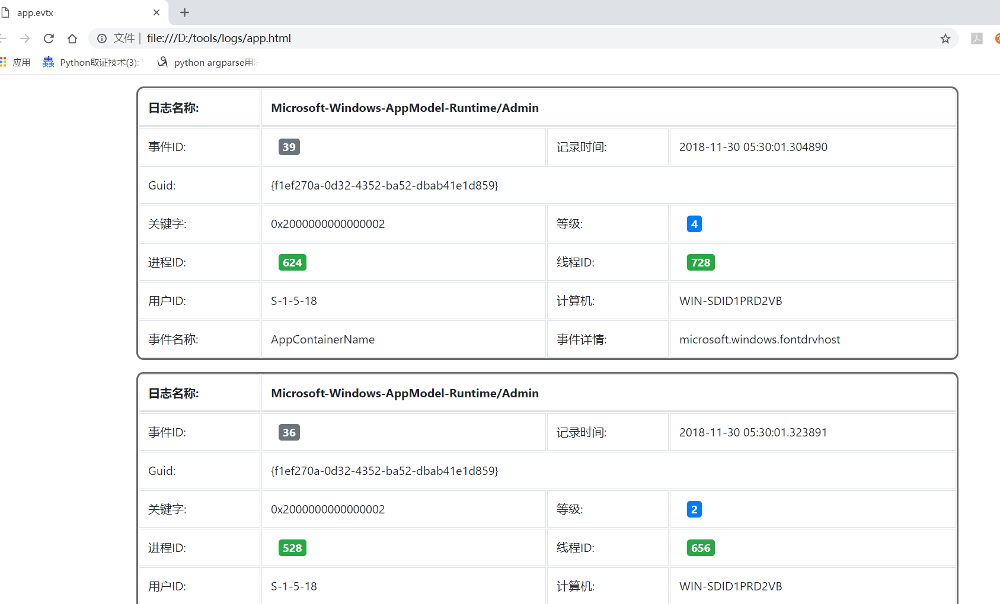
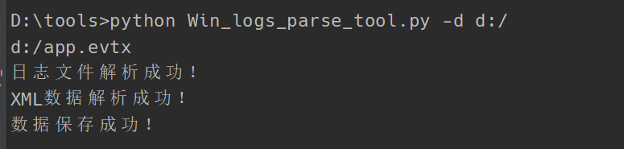

# Windows安全日志解析工具

可解析windows系统目录下的安全日志文件 ( 需获取管理员权限 )，也可采用手动添加文件的方式进行解析，解析后的文件为XML，HTML两种格式，HTML已采用Bootstrap框架进行界面可视化优化，可直接查看重点日志数据，解析后的HTML数据文件保存在执行文件下的`logs/`文件夹下 ( 自动创建 )，XML数据文件保存在执行文件下的`logs/xml/`文件夹下，本工具采用Python语言开发。


### 功能特点

- 日志文件可视化解析
- 原始数据保存为XML文件
- 管理员运行可直接解析系统日志
- 可采用手动添加文件或目录方式进行解析


### 参数解析

```shell
optional arguments:
  -h, --help            show this help message and exit
  -s, --system          读取并解析指定的windows日志
  -f FILE, --file FILE  指定一个evtx文件进行解析
  -d DIR, --dir DIR     指定一个目录，解析目录下所有evtx文件(默认为系统日志文件夹)
```


### 源码结构

```
├─import              # 引用模块
├─argparse            # 参数解析模块
├─parse_logs          # evtx日志文件解析模块
├─XML_parse           # XML数据解析模块
├─save_data           # 数据保存模块
└─__main__            # 主模块
```


### 功能详情

- ##### `argparse `——参数解析模块

  - 所需模块：`argparse`

  - 功能： `-h  --help` :  显示参数帮助文档

    ​             `-s --system` : 读取并解析系统日志，需手动选择解析文件

    ​	     `-f  --file` : 指定日志文件进行解析，如执行：`python tool.py -f D:/Application.evtx`

    ​	     `-d --dir` : 指定目录，解析目录下所有日志文件，如执行：`python tool.py -f D:/log/`

- ##### `parse_logs`——`evtx`日志文件解析模块

  - 所需模块：`Evtx,contextlib,mmap`
  - 功能：利用`python-evtx`模块解析`.evtx`文件数据，遍历事件，将事件解析为`XML`数据格式，单个事件顶级标签为<event>，返回单个文件解析的所有`XML`数据。

- ##### `XML_parse`——`XML`数据解析模块

  - 所需模块：`xml.dom.minidom`
  - 功能：将 XML 数据在内存中解析成一个树，通过对树的操作来操作 XML。返回一个字典列表，列表长度为文件内事件数，字典内保存获取的数据。

- ##### `save_data`—— 数据保存模块

  - 所需模块：`os,codecs,string.Template`
  - 功能：通过传入的`mod`参数判断保存数据格式
    - XML下：
      1. 判断是否存在`log/xml/`文件夹，不存在则创建
      2. 写入与`evtx`文件同名的`XML`文件
      3. 为XML文件添加顶级标签<data> <!--不添加则无法解析XML文件-->
      4. 写入`parse_logs`返回的`XML`数据
    - HTML下：
      1. 利用字符串模板，将提前定义好的`html`文件模板字符串的变量进行替换
      2. 循环遍历`XML_parse`返回的列表，将变量绑定至`HTML`文件
      3. 单个列表绑定一个`table`表格
      4. 写入数据

- ##### `__main__`——程序入口

  1. 判断参数
  2. 遍历目录（如解析单个文件则没有此功能）
  3. 将.evtx文件解析为XML数据
  4. 将XML数据保存为XML文件
  5. 将XML文件数据解析为DOM树，获取数据并返回一个字典列表
  6. 将字典列表数据通过字符串模板写入HTML文件内


### 程序演示

##### 执行`--help`参数：



##### 执行`--system`参数：

###### ​文件选择界面：





##### 执行`--file`参数：



##### 自动创建文件夹及文件：


##### `XML`文档内容：



##### `HTML`文档内容：



##### 执行`--dir`参数：




### 已知缺陷

- 采用阻塞式I/O开发，在解析大文件或目录下多个文件时程序运行较慢。


### 联系我

------

